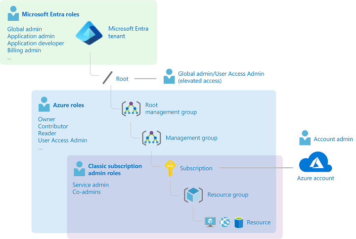
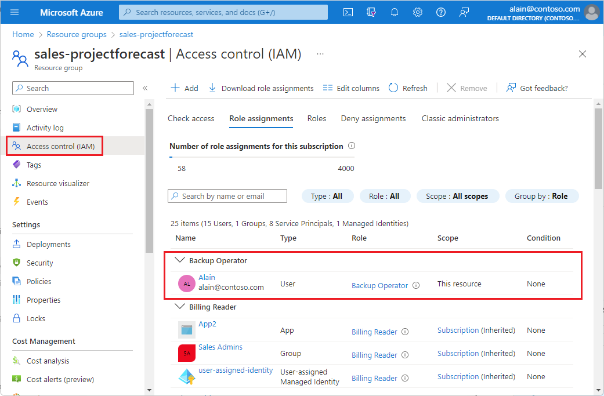
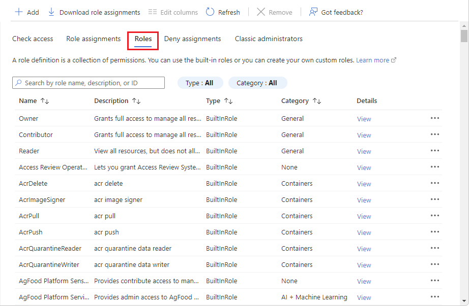
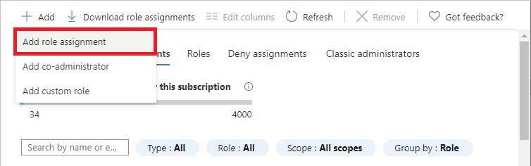
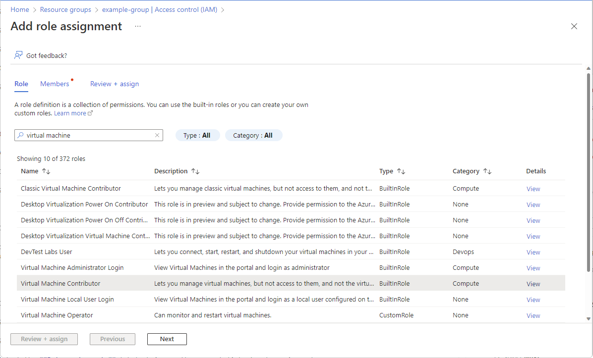
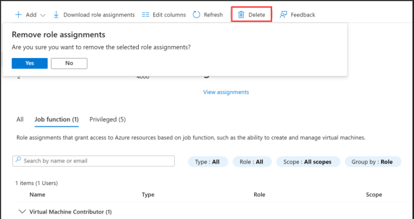
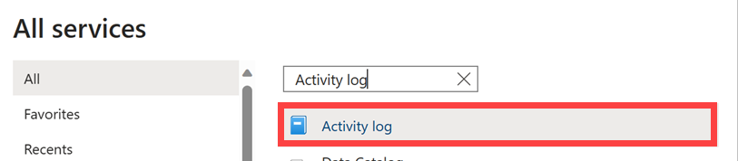
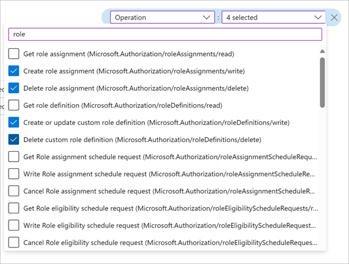

# Azure RBAC Resource Security

## Overview

Secured Azure resources by assigning scoped RBAC roles to control access at the right permission level, verified existing access for multiple users, and audited role assignment changes through Azure Activity Logs.

## Objectives

- Verify access to resources for ourself and others.
- Grant access to resources.
- View activity logs of Azure RBAC changes.

---

## What is Azure RBAC?

Azure RBAC (Role-Based Access Control) is an authorization system built on Azure Resource Manager that provides fine-grained access management for resources in Azure.

With Azure RBAC, you can grant the exact access that users need to do their jobs. For example:
- Let one employee manage **virtual machines** in a subscription.
- Let another manage **SQL databases** within the same subscription.

A role assigned at a **parent scope** also grants access to the **child scopes** contained within it. For example, a user with access to a resource group can manage all resources it contains — websites, virtual machines, and subnets.

The following shows an example of the **Access control (IAM)** pane for a resource group. In this example, Alain has been assigned the **Backup Operator** role for this resource group.

---

## Task 1: List Role Assignments

1. Sign in to the [Azure portal](https://portal.azure.com).
2. On the Profile menu, select the ellipsis (**...**) to see more links.
3. Select **My permissions** to open the My permissions pane.
4. Find the roles that you've been assigned and the scope.

---

## Task 2: List Role Assignments for a Resource Group

1. In the Search box at the top, search for and select **Resource groups**.
2. In the list of resource groups, select a resource group.
3. On the left menu pane, select **Access control (IAM)**.
4. Select the **Role assignments** tab.

> Notice that some roles are scoped to **This resource**, while others are **(Inherited)** from a parent scope.

### Task 2.2: List Roles

Azure has more than **70 built-in roles** that can be used in role assignments.

1. In the menu bar at the top of the pane, select the **Roles** tab to list all built-in and custom roles.
2. Select a role's **View** link in the Details column.
3. Select the **Assignments** tab to display the number of users and groups assigned to that role.

**Task Complete:** Listed role assignments for yourself in the Azure portal and learned how to list role assignments for a resource group.

---

## Task 3: Grant Access

Procedure to assign the **Virtual Machine Contributor** role to a user at the resource group scope:

1. Sign in to the Azure portal as an administrator with permissions to assign roles.
2. In the Search box at the top, search for **Resource groups**.
3. In the list of resource groups, select a resource group.
4. On the left menu pane, select **Access control (IAM)**.
5. Select the **Role assignments** tab to display the current list of role assignments at this scope.
6. Select **Add > Add role assignment**.

> If you don't have permissions to assign roles, the **Add role assignment** option will be disabled.

7. On the **Role** tab, search for and select **Virtual Machine Contributor**.

8. Select **Next**.
9. On the **Members** tab, select **Select members**.
10. Search for and select a user.
11. Select **Select** to add the user to the Members list.
12. Select **Next**.
13. On the **Review + assign** tab, review the role assignment settings.
14. Select **Review + assign** to assign the role.

After a few moments, the user is assigned the **Virtual Machine Contributor** role at the resource group scope. The user can now create and manage virtual machines just within this resource group.

**Task Complete:** Granted access to a resource group.

---

## Task 4: Remove Access

In Azure RBAC, you can remove a role assignment to remove access.

1. In the list of role assignments, select **View Assignments**.
2. Search for and check the box for the user with the **Virtual Machine Contributor** role.
3. Select **Delete**.

4. In the **Remove role assignments** message that appears, select **Yes**.

**Task Complete:** Learned how to grant and remove access.

---

## Task 5: View Activity Logs for Azure RBAC Changes

Changes to role assignments are logged in the **Azure Activity Log**.

1. Select **All services**, then search for **Activity log**.

2. Select **Activity log** to open the activity log.
3. Set the **Timespan** filter to **Last month**.
4. Add an **Operation** filter and type `role` to filter the list.
5. Select the following Azure RBAC operations:
   - Create role assignment (roleAssignments)
   - Delete role assignment (roleAssignments)
   - Create or update custom role definition (roleDefinitions)
   - Delete custom role definition (roleDefinitions)

A list of all role assignment and role definition operations for the last month is displayed. There is also a button at the top of the screen to **download the activity log as a CSV file**.

6. Select one of the operations to get the activity log details.

**Task Complete:** Learned how to use Azure Activity Log to list Azure RBAC changes in the portal and generate a simple report.

---

## Conclusion

- ✅ Verified access to resources for ourself and others.
- ✅ Granted access to resources.
- ✅ Viewed activity logs of Azure RBAC changes.

---

## Additional Resources

Check out [What is Azure role-based access control (Azure RBAC)?](https://learn.microsoft.com/en-us/azure/role-based-access-control/overview)
